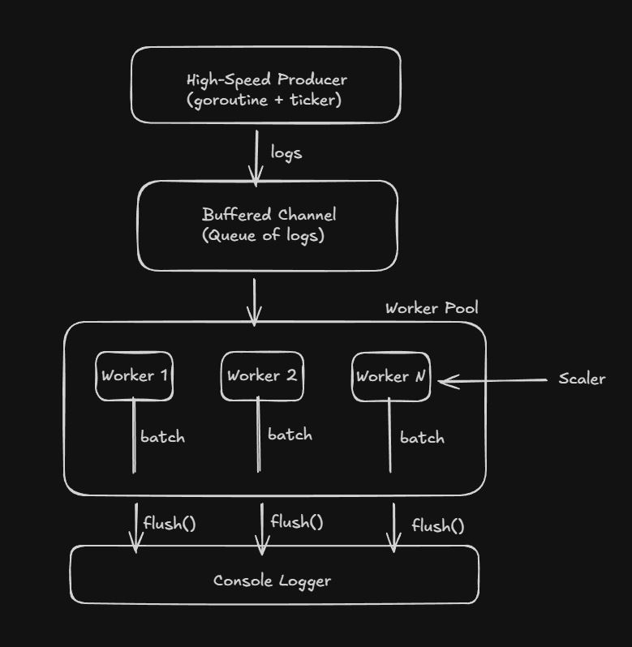

# High-Throughput Log Generator & Auto-Scaling Worker Pipeline
This project demonstrates how to build a high-performance, backpressure-aware, auto-scaling log processing pipeline using Go’s concurrency model.
It is designed as a learning-oriented yet production-grade implementation of concepts found in Logstash, Fluent Bit, Beats, Kafka Producers, Distributed worker pipelines.

## Project Goals
The goal of this project is to deeply understand:
- Go concurrency (goroutines, channels, select, context)
- High-throughput producers
- Worker pool patterns
- Batch processing + timeout flush
- Queue pressure & backpressure handling
- Dynamic worker auto-scaling based on queue usage
- Graceful shutdown of distributed components
- Metrics & observability
- Clean architecture layout

In essence, this project implements a mini log ingestion engine from scratch.
## Architecture Overview


## High-Throughput Producer
The producer:
- Runs in its own goroutine
- Uses a ticker to generate logs at configurable intervals
- Writes JSON-formatted logs into a channel
- Supports backpressure-aware slowdowns
- Stops gracefully via context cancellation
- Increments metrics for monitoring

Example log:
```json
{"msg": "hello from producer", "level": "INFO", "ts": 1712345678123456}
```
## Worker Pool
Each worker:
- Reads logs from the shared channel
- Buffers them into a batch
- Flushes when:
  - batchSize is reached, or
  - batchTimeout expires
- Flushes remaining logs before exiting
- Supports individual stop signals (StopChan)
- Updates processing metrics
- Runs fully concurrently

This models real-world pipelines such as Kafka Consumers, Logstash Workers, etc.

## Batch Processing + Timeout Flush
Batching dramatically increases throughput by reducing:
- Context switching
- Logger I/O overhead
- Channel operations

Configurable parameters:
| Setting      | Description                | Example |
| ------------ | -------------------------- | ------- |
| batchSize    | Maximum logs before flush  | 100     |
| batchTimeout | Max wait time before flush | 100ms   |

A worker flushes when either condition is met.

## Queue Backpressure Handling
To avoid overload and CPU thrashing, the producer monitors queue usage:
```
queue_usage = len(queue) / cap(queue)
```
Auto slowdown:
| Queue Usage | Producer Sleep |
| ----------- | -------------- |
| >95%        | 2ms            |
| >90%        | 1ms            |
| >80%        | 500µs          |
| Normal      | 0              |

This ensures the system self-stabilizes under heavy load.

## Auto-Scaling Worker Pool
The autoscaler monitors queue pressure and adjusts worker count dynamically:
- Scale up when queue usage > 80%
- Scale down when queue usage < 20%
- Ensures worker count stays within min/max bounds
- Fully context-aware -> stops scaling during shutdown

Examples:
``` makefile
Scaler: scaling UP, workers = 2
Scaler: scaling UP, workers = 3
Scaler: scaling Down, workers = 2
```
This replicates behavior of Kubernetes HPA, Logstash worker scaling, and Kafka consumer scaling.

## Graceful Shutdown
Pipeline shutdown guarantees zero log loss:
1. SIGINT / Ctrl+C detected
2. Producer receives context cancellation
3. Autoscaler stops
4. Channel is closed
5. Workers flush remaining batches
6. WaitGroup waits for all workers to exit
7. Program exits cleanly

Example:
``` makefile
Shutdown signal received!
Worker 3 flushed batch of 7 logs
Worker 1 flushed batch of 10 logs
Program finished
```
## Real Test Output
Autoscaling in action:
``` makefile
Scaler: scaling UP, workers = 2
Scaler: scaling UP, workers = 3
Scaler: scaling UP, workers = 4
```
Metrics under load:
``` makefile
[METRICS] Produced=1477/s | Processed=150/s | Queue=1277/1500 | Workers=2
```
This shows:
- Producer outruns workers
- Queue pressure rises
- Autoscaler responds accordingly

## Configuration Parameters
| Parameter         | Description              | Example    |
| ----------------- | ------------------------ | ---------- |
| ProducerRate      | Base log generation interval (adaptive under backpressure) | 100µs, 1ms |
| ChannelSize       | Buffered queue size      | 1500    |
| BatchSize         | Worker batch limit       | 50        |
| BatchTimeout      | Max wait duration        | 500ms      |
| MinWorkers        | Lower worker bound       | 1          |
| MaxWorkers        | Upper worker bound       | 10         |
| AutoScaleInterval | Check frequency          | 1s         |
| ScaleUpThreshold   | Queue usage to scale up   | 0.8 |
| ScaleDownThreshold | Queue usage to scale down | 0.2 |

## What We Learned
1. Go Concurrency (Deep Dive)
  - Goroutines
  - Channels
  - Select-based event loops
  - WaitGroup coordination
  - Context cancellation
2. Pipeline Architecture
  - Producer -> Queue -> WorkerPool
3. Backpressure & Stability
  - Dynamic slowdown
  - Queue monitoring
  - Preventing overload
4. Auto Scaling Design
  - Threshold-based scaling
  - Worker lifecycle management
  - StopChan pattern
  - Context-aware components
5. Zero Data Loss Shutdown
  - Ensuring all buffered logs are processed
  - Coordinating components under termination
6. Clean Architecture
  - domain
  - application
  - infrastructure

This mirrors modern distributed log processing engines.

## Challenges & Solutions
1. Producer too fast or too slow
  - Implemented ticker-based production with adaptive pacing under backpressure
  - Added metrics to observe real-time production throughput
2. Workers losing logs on shutdown
  - Ensured flush-before-exit to drain remaining batches
  - Introduced StopChan for graceful worker termination
3. Autoscaler interfering during shutdown
  - Made autoscaler context-aware to prevent scaling after shutdown signal
4. Concurrent WorkerPool modifications
  - Protected worker add/remove operations with mutex to ensure thread safety
5. Backpressure tests were too fast
  - Introduced artificial IO latency in workers to simulate real bottlenecks
  - Tuned producer rate and batch parameters for observable backpressure

## Conclusion
This project serves as a hands-on, production-style exploration of:
  - Concurrency
  - Scaling
  - Stability
  - Backpressure
  - Pipeline design
