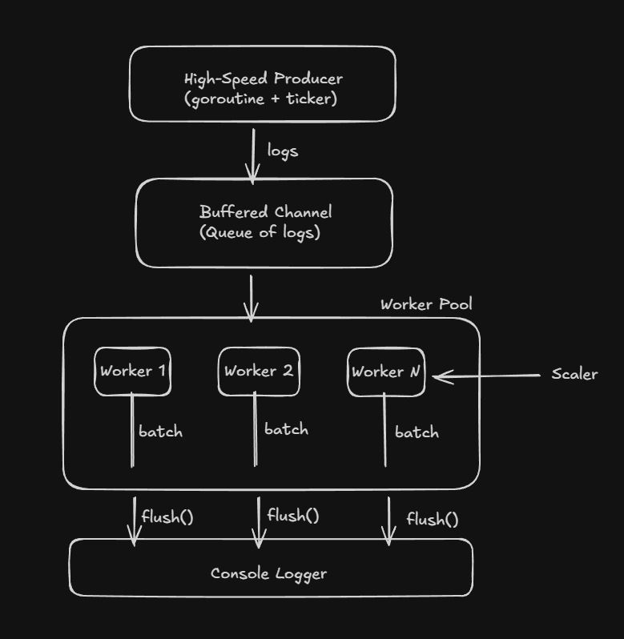

# High-Throughput Log Generator & Auto-Scaling Worker Pipeline

A high-performance, backpressure-aware, auto-scaling log processing pipeline built in Go.

Implements core concepts found in Logstash, Fluent Bit, Beats, Kafka Producers, and distributed worker pipelines.

---

## Architecture Overview


### Components

- **Producer** — generates JSON-formatted log events at a configurable rate
- **Buffered Channel** — decouples producer from workers; acts as the queue
- **Worker Pool** — consumes logs, buffers into batches, flushes on size or timeout
- **Autoscaler** — monitors queue pressure and adjusts worker count dynamically
- **Metrics** — real-time throughput and queue stats

---

## Features

- High-throughput log production with adaptive backpressure
- Batch processing with size and timeout-based flushing
- Dynamic worker scaling based on queue utilization
- Zero log loss on graceful shutdown
- Real-time metrics output

---

## Example Log Event

```json
{"msg": "hello from producer", "level": "INFO", "ts": 1712345678123456}
```

---

## Configuration

| Parameter          | Description                        | Default |
|--------------------|------------------------------------|---------|
| ProducerRate       | Base log generation interval       | 100µs   |
| ChannelSize        | Buffered queue capacity            | 1500    |
| BatchSize          | Max logs per worker batch          | 50      |
| BatchTimeout       | Max wait before force flush        | 500ms   |
| MinWorkers         | Minimum worker count               | 1       |
| MaxWorkers         | Maximum worker count               | 10      |
| AutoScaleInterval  | Autoscaler check frequency         | 1s      |
| ScaleUpThreshold   | Queue usage ratio to scale up      | 0.8     |
| ScaleDownThreshold | Queue usage ratio to scale down    | 0.2     |

---

## Running

```bash
go run ./cmd/main.go
```

---

## Sample Output

```
Scaler: scaling UP, workers = 2
Scaler: scaling UP, workers = 3
[METRICS] Produced=1477/s | Processed=150/s | Queue=1277/1500 | Workers=2
Worker 3 flushed batch of 7 logs
Program finished
```

---

## Shutdown Behavior

1. `SIGINT` received
2. Producer stops via context cancellation
3. Autoscaler stops
4. Channel is closed
5. Workers flush remaining batches
6. WaitGroup drains all goroutines
7. Program exits cleanly

---

## Design & Trade-offs

See [DESIGN.md](DESIGN.md) for internal design decisions, trade-offs, and alternatives considered.

